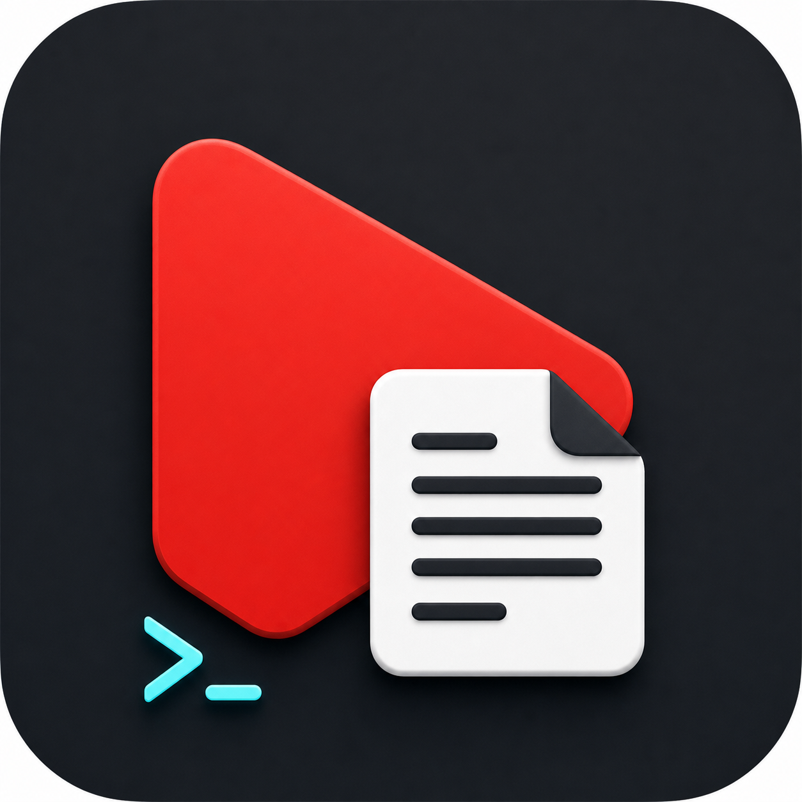

<p align="center">
  
</p>

# yt-scribe

Turn a YouTube link into a transcript, then ask Codex to polish it into readable notes, summaries, cleaned text, or article-style prose.

`yt-scribe` is built for two audiences:

- Humans who want a simple command that produces useful writing from a video.
- AI agents that need stable JSON, explicit lifecycle steps, and small composable commands.

It uses public YouTube caption tracks when they are available through `youtube-transcript-api`. It does not download video or audio. Polishing is done locally through `codex exec`, so it reuses your existing Codex CLI authentication.

## Install

From GitHub:

```powershell
pip install git+https://github.com/Berkay2002/yt-scribe.git
```

For local development or immediate use from a checkout:

```powershell
.\install-local.ps1
```

Check your setup:

```powershell
yt-scribe doctor
```

`yt-scribe` uses `youtube-transcript-api` for caption access. Maintainers can install test and lint tools with:

```powershell
pip install -e .[dev]
```

## Quick Start

Fetch and polish a video in one command:

```powershell
yt-scribe run "https://www.youtube.com/watch?v=VIDEO_ID" --style notes --out notes.md
```

Keep the raw transcript too:

```powershell
yt-scribe run "https://www.youtube.com/watch?v=VIDEO_ID" --transcript transcript.txt --out notes.md
```

Download only the transcript:

```powershell
yt-scribe fetch "https://www.youtube.com/watch?v=VIDEO_ID" --out transcript.txt
```

Polish an existing transcript:

```powershell
yt-scribe polish transcript.txt --style summary --out summary.md
```

## Lifecycle

`yt-scribe` is easiest to understand as a small pipeline:

```powershell
yt-scribe doctor
yt-scribe inspect "<youtube-url>"
yt-scribe fetch "<youtube-url>" --out transcript.txt
yt-scribe polish transcript.txt --style notes --out notes.md
yt-scribe run "<youtube-url>" --transcript transcript.txt --out notes.md
```

Run this any time to print the same lifecycle from the CLI:

```powershell
yt-scribe lifecycle
```

## Commands

`doctor`

Checks Python, Codex CLI, PATH installation, and the expected lifecycle.

`inspect <url>`

Resolves the YouTube video and lists caption tracks.

`fetch <url>`

Downloads the transcript without calling Codex.

Useful options:

```powershell
yt-scribe fetch "<url>" --lang en --format text --out transcript.txt
yt-scribe fetch "<url>" --format srt --out captions.srt
yt-scribe fetch "<url>" --format json --out transcript.json
```

`polish <file>`

Uses `codex exec` to polish an existing transcript.

```powershell
yt-scribe polish transcript.txt --style clean --out clean.txt
yt-scribe polish transcript.txt --style notes --out notes.md
yt-scribe polish transcript.txt --style summary --out summary.md
yt-scribe polish transcript.txt --style article --out article.md
```

`run <url>`

Fetches the transcript and polishes it in one command.

```powershell
yt-scribe run "<url>" --style notes --transcript transcript.txt --out notes.md
```

`raw <url>`

Read-only diagnostic escape hatch for inspecting the selected YouTube timedtext caption URL. Most users do not need this because normal transcript fetching uses `youtube-transcript-api`.

```powershell
yt-scribe raw "<url>" --lang en
```

## AI-Friendly JSON

Put `--json` before the command:

```powershell
yt-scribe --json doctor
yt-scribe --json inspect "<url>"
yt-scribe --json fetch "<url>" --out transcript.txt
yt-scribe --json run "<url>" --style notes --out notes.md
```

Successful commands return:

```json
{
  "ok": true,
  "fetch": {
    "video_id": "VIDEO_ID",
    "output_path": "C:\\path\\transcript.txt"
  }
}
```

Errors return:

```json
{
  "ok": false,
  "error": {
    "code": "no_captions",
    "message": "No caption tracks were found for this video"
  }
}
```

## How Codex Is Used

`polish` and `run` call:

```text
codex exec --ephemeral --skip-git-repo-check --sandbox read-only --output-last-message <temp-file> "<instruction>"
```

The transcript is passed through stdin. Codex progress stays separate from the final output, and the final message is read from the file written by `--output-last-message`.

If the optional Codex plugin is installed, the inner `codex exec` agent uses a dedicated `yt-scribe-transcript-polisher` skill for the transcript rewrite. A separate `yt-scribe` skill is for outer Codex agents that want to run the CLI.

## Codex Plugin

This repository also contains a Codex plugin:

- `skills/yt-scribe`: for an outer Codex agent that wants to use the CLI.
- `skills/yt-scribe-transcript-polisher`: for the inner `codex exec` agent that receives transcript text on stdin and rewrites it.

The split matters. The outer agent fetches, saves, and chains commands. The inner agent only transforms transcript text and should not fetch videos or run shell commands.

The local personal plugin scaffold is created at:

```text
C:\Users\berka\plugins\yt-scribe
```

## Notes

- A video must have captions available.
- `youtube-transcript-api` uses an undocumented YouTube web-client API, so YouTube can change or block behavior.
- If YouTube blocks the IP running the command, the underlying library may raise request-blocking errors. The upstream project documents proxy support for those cases.
- `yt-scribe` does not bypass private, unavailable, or disabled captions.
- Long transcripts can be truncated deliberately with `--max-chars`.
